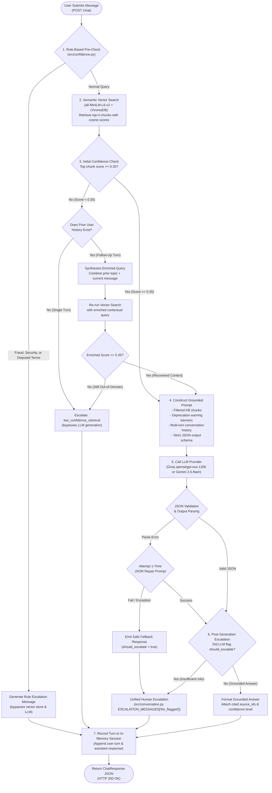

# LearnForge System Architecture & Query Flow

This document details the end-to-end architecture, decision logic, and data flow of the LearnForge AI Support Assistant.

---

## 1. System Pipeline Architecture Diagram

The flowchart below illustrates the exact execution pipeline implemented in [`src/conversation.py`](file:///Users/mac/Documents/Assessment/Edversity/src/conversation.py) for each conversational turn, including the multi-turn contextual enrichment branch and defensive recovery guardrails.

---

## 2. End-to-End Query Flow Walkthrough

Each request entering `POST /chat` progresses through seven decoupled stages designed to maximize answer grounding, minimize latency, and eliminate ungrounded hallucinations:

### Stage 1: Rule-Based Pre-Retrieval Filter
- **Purpose**: Identify high-stakes queries requiring immediate human intervention without burning LLM tokens or introducing generation latency.
- **Mechanism**: [`src/confidence.py`](file:///Users/mac/Documents/Assessment/Edversity/src/confidence.py) inspects the raw user string using regex patterns targeting two distinct categories:
  - Unrecognized transactions, payment fraud, or compromised accounts (`category="fraud_or_security"`).
  - Disputed terms, conflicting verbal promises, or referenced guarantee periods (`category="disputed_policy_terms"`).
- **Short-Circuit Action**: If triggered, the pipeline immediately returns an empathetic, pre-scripted handoff message, updates history, and exits in `<1ms`.

### Stage 2: Semantic Vector Retrieval
- **Purpose**: Extract the most relevant knowledge base chunks for normal queries.
- **Mechanism**: The query is embedded via `sentence-transformers/all-MiniLM-L6-v2` into a 384-dimensional vector and matched against the 40 indexed chunks in ChromaDB.
- **Distance-to-Similarity Conversion**: Raw squared Euclidean distance ($d^2$) is transformed into normalized cosine similarity ($\text{sim} = 1.0 - \frac{d^2}{2.0}$) in $[0.0, 1.0]$. The top-4 chunks with their metadata are returned.

### Stage 3: Retrieval Confidence & Contextual Follow-Up Enrichment
- **Threshold Check**: If the top similarity score is $\ge 0.35$, retrieval is considered confident and execution proceeds to prompt construction.
- **The Contextual Gap**: In multi-turn conversations, follow-up queries are often anaphoric or fragmentary (e.g. *"What about on my laptop specifically?"*). Evaluated in isolation, this query yields a low similarity score of `0.3078`, which would trigger a false-positive escalation.
- **Enrichment Branch**: If the initial score is below `0.35` but the session has prior turns, [`src/conversation.py`](file:///Users/mac/Documents/Assessment/Edversity/src/conversation.py) extracts the previous user message topic and forms an enriched query (`"Can I download course videos to watch offline? What about on my laptop specifically?"`).
- **Observed Result**: Re-retrieval on the enriched query increases the similarity score to `0.8386`, successfully retrieving `FAQ-07` and `POLICY-04` and allowing grounded generation to continue. If the score remains below `0.35` after enrichment, the turn escalates as `low_confidence_retrieval`.

### Stage 4: Prompt Construction & Deprecation Handling
- **Context Assembling**: The top retrieved chunks are formatted with `doc_id`, `topic`, and content.
- **Stale Policy Guardrail**: If any retrieved chunk has `has_deprecated_content = True`, a high-priority system instruction is injected: *"Notice: Certain passages contain outdated or superseded terms. Answer exclusively according to current policy terms and explicitly point out current limitations."*
- **History Injection**: The last 3 conversation turns are injected into the prompt to preserve conversational context.

### Stage 5: Grounded LLM Generation & Defensive Parsing
- **LLM Provider**: Invokes Groq (`openai/gpt-oss-120b`) or Gemini (`gemini-2.5-flash`) with temperature `0.0`.
- **Structured JSON Schema**: The model must output valid JSON containing `answer`, `source_ids`, `confidence`, and `should_escalate`.
- **Parsing Guardrail**: If the LLM generates invalid JSON, [`src/llm.py`](file:///Users/mac/Documents/Assessment/Edversity/src/llm.py) triggers an automated one-time repair prompt with the parsing error. If the retry fails or the API times out, it yields a safe fallback response without crashing the application.

### Stage 6: Post-Generation Escalation Normalization
- If the LLM flags `should_escalate = true` (e.g. recognizing an in-domain policy inquiry with missing details), the system intercepts the response and serves a friendly, professional handoff message from `ESCALATION_MESSAGES["llm_flagged"]` in [`src/conversation.py`](file:///Users/mac/Documents/Assessment/Edversity/src/conversation.py), ensuring uniform brand voice across all escalation paths.

### Stage 7: In-Memory History Update & API Response
- The turn is appended to the session's history log, recording `role`, `content`, and any cited `sources`.
- The endpoint returns a typed `ChatResponse` model with HTTP 200 OK.

---

## 3. Why Retrieval-Augmented Generation (RAG)?

For an educational platform like LearnForge, RAG was chosen over fine-tuning or zero-shot prompt stuffing for four architectural reasons:

1. **Zero-Latency Policy Updates**:
   When tuition refund windows or offline playback policies change, updating a model via fine-tuning requires hours of dataset preparation and compute cost. In RAG, an operator updates `data/policies.md` and runs `python src/ingest.py` in seconds.
2. **Auditability and Citation Grounding**:
   In high-stakes customer support (billing disputes, certificate credentials), answers must be verifiable. RAG produces explicit source citations (`FAQ-02`, `POLICY-02`) mapped to underlying documents, enabling agents and learners to audit claims directly.
3. **Hallucination Prevention on Proprietary Data**:
   Standard LLMs lack proprietary internal knowledge of LearnForge's tiering, LMS features, and refund terms. RAG bounds model knowledge strictly to retrieved passages, replacing plausible hallucinations with deterministic escalation cutoffs.
4. **Active Handling of Stale Information**:
   Customer support data frequently contains historical policy revisions. RAG enables document-level metadata filtering and dynamic prompt conditioning (`has_deprecated_content = True`) to actively warn the model against citing deprecated clauses.
